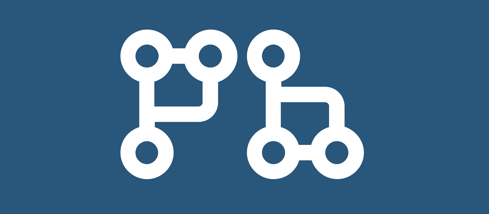

## PullBot

## Sobre
Consiste em um bot de produtividade ativado no git a cada fechamento de milestone te dando um apanhado geral da atual sprint e realizando automaticamente um Pull Request. 

Quando se está trabalhando em times de software é muito importante gerenciar o andamento do projeto de perto e ter um feedback consistente de tudo que está ocorrendo em sua sprint, o PullBot se encaixa aí! Sua utilidade principal é o gerenciamento efetivo do projeto, e por consequência, ganho de tempo e maior controle de todo trabalho.
## Colaboradores
|Nome|  Função| 
|----|--------|
[Arthur Garcia](https://github.com/ArthurMeloG)| Product Owner e Desenvolvedor|
[Jaime Juan](https://github.com/JaimeJuan11)| Scrum Master e Devops|
[Eliás Yousef](https://github.com/ingridSCarvalho)| Arquiteto e Desenvolvedor|
[Ingrid Carvalho](https://github.com/zpeniel09)| Desenvolvedor|
[Lorrayne Cardozo](https://github.com/LorrayneCardozo)| Desenvolvedor|
[Peniel Zannoukou](https://github.com/eliasyousef00)| Desenvolvedor|
## Contribuição

Para contribuir com o projeto, [leia](https://github.com/fga-eps-mds/PullBot/blob/master/CONTRIBUTING.md).

## Licença
Confira nossa licença [aqui](https://github.com/fga-eps-mds/PullBot/blob/master/LICENSE).

Copyright &copy; 2020 PullBot
